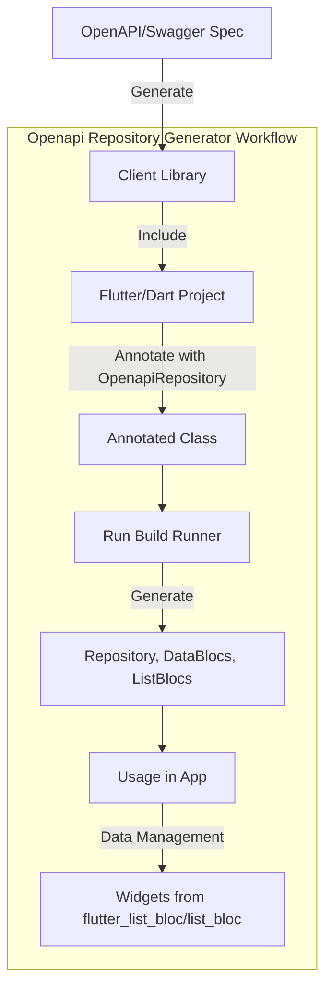

# Openapi Repository Generator

## Overview

The Openapi Repository Generator is designed to enhance the functionality of the [openapi-generator-cli](https://github.com/OpenAPITools/openapi-generator-cli) by generating repositories, blocs, and [freezed](https://pub.dev/packages/freezed) models specifically tailored for query params filters in OpenApi modules. This generator is particularly useful in scenarios where efficient handling of pagination and data filtering is required.

## Key Components

- **openapi-generator-cli:** A tool to generate client libraries, documentation, and tests for Dart language from OpenApi/Swagger spec files.
- **Bloc Library:** Utilized for creating `DataCubit` and `ListCubit` for state management, supporting pagination and filtering.
- **openapi_repository Library:** Automates the generation of `DataCubit` and `ListCubit`, simplifying the integration with widgets provided in `list_bloc` and `flutter_list_bloc`.

## Installation and Setup

### For Flutter Projects

```Dart
flutter pub add openapi_repository_annotations
flutter pub add list_bloc
flutter pub add flutter_list_bloc
flutter pub add dio
flutter pub add openapi_repository --dev
flutter pub add build_runner --dev
```

### For Dart Projects

```Dart
dart pub add openapi_repository_annotations
dart pub add list_bloc
dart pub add flutter_list_bloc
dart pub add dio
dart pub add openapi_repository --dev
dart pub add build_runner --dev
```

## Usage

1. Generate the OpenApi client library using OpenApi(Swagger) schema definitions.
2. Make sure you've generated `OpenApi` client library using OpenApi(Swagger) schema definitions and [openapi-generator-cli](https://github.com/OpenAPITools/openapi-generator-cli). And make sure that each `operationId` in the OpenApi(Swagger) schema has operations(`create`, `update`, `partial_update`, `retrieve`, `destroy`, `list` etc) suffix which helps the library to detect methods. For each CRUD operations it also checks api call method. (retrieve -> GET, list -> GET, create -> POST, update -> PUT, partial_update -> PATCH, destroy -> DELETE)
3. Create a Flutter/Dart project and import the generated OpenApi client library.
4. Use the `@OpenapiRepository` annotation on the class to hold generated files.
5. Run the build runner command to generate Repository, DataBlocs, and ListBlocs.

## How It Works

The generator uses the `@OpenapiRepository` annotation to identify classes for code generation. It processes these classes to generate `Repository, DataBlocs, ListBlocs` based on the methods defined in the OpenApi client library. The generated blocs can be directly used with widgets from `flutter_list_bloc` or `list_bloc`.

### Code Generation Process

1. **Annotation Processing:** The `@OpenapiRepository` annotation is used to mark classes for repository and bloc generation.
2. **Repository and Bloc Generation:** Based on the annotated class, the generator creates `DataBlocs` and `ListBlocs`, inheriting methods from the generated repository class.
3. **Integration with Bloc Widgets:** The generated blocs are designed to work seamlessly with `flutter_list_bloc` and `list_bloc` widgets.

## Detailed Examples

- [Annotation Usage Example](https://github.com/djangoflow/demo-flutter/blob/main/packages/demo/lib/data/api_repository/api_repository.dart)
- [Generated Files Example](https://github.com/djangoflow/demo-flutter/blob/main/packages/demo/lib/data/api_repository/api_repository.openapi.dart)
- [In-depth Explanation](./CODE_EXPLANATION.md)

## Generator Mechanics

### The Generator Class

The `OpenapiRepositoryGenerator` class extends `GeneratorForAnnotation<OpenapiRepository>` and is responsible for generating the required code when the `@OpenapiRepository` annotation is detected.

### Visitor Pattern

The generator employs a visitor pattern to inspect and process elements annotated with `@OpenapiRepository`. This includes parsing methods, determining their return types, and generating corresponding repository and bloc code.

### Builder Configuration

The `PartBuilder` is used to specify the output format of the generated code. The configuration in `build.yaml` dictates how the builder operates, including file extensions and build targets.

### Diagram



## Conclusion

The Openapi Repository Generator significantly simplifies the process of working with OpenApi in Flutter and Dart projects, especially when dealing with pagination and data filtering. By automating the generation of repositories and blocs, it reduces boilerplate and streamlines the integration with state management solutions.
